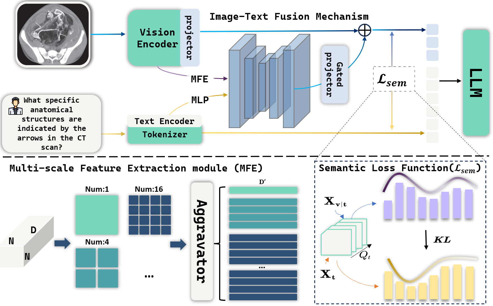

# BioD2C
The official codes for [**BioD2C: A Dual-level Semantic Consistency Constraint Framework for Biomedical VQA**]
<p align="center">
 
</p>

# Contents

- [Install](#install)
- [Data Download](#data-download)
- [Model Download](#model-download)
- [Evaluation](#evaluation)
- [Train](#train)
- [Citation](#citation)

## Install
1. Clone this repository and navigate to BiLENS folder
```bash
https://github.com/jzy-123/BioD2C.git
cd BioD2C
```
2. Install Package: Create conda environment
```shell
conda create -n bilens python=3.10 -y
conda activate bilens
conda install pytorch==2.5.1 torchvision==0.20.1 torchaudio==2.5.1 pytorch-cuda=12.4 -c pytorch -c nvidia
pip install -r requirements.txt
```

## Data Download
| Dataset   | Link |
|-----------|------|
| VQA-RAD   | [Download](https://osf.io/89kps/) |
| SLAKE     | [Download](https://www.med-vqa.com/slake/) |
| Path-VQA  | [Download](https://github.com/UCSD-AI4H/PathVQA) |
| BioVGQ    | [Download](https://huggingface.co/datasets/jzyang/BioVGQ) |

The BioVGQ dataset and other downstream test datasets can be downloaded through the links provided in the table.

To obtain the PMC-600K dataset used in the training stage 1, execute the following commands:
```shell
wget https://hanoverprod.z21.web.core.windows.net/med_llava/llava_med_image_urls.jsonl
mkdir pmc_articles
mkdir images
python script.py
```

## Model Download

| Model | Hugging Face Hub |
|-------|-----------------|
| BioD2C | [[jzyang/BioD2C]](https://huggingface.co/jzyang/BioD2C) |

Click [PMC-CLIP](https://github.com/WeixiongLin/PMC-CLIP) to download the weight parameters of the visual encoder and save them in the `/models/pmcclip` folder.

## Evaluation
Run `test_Slake.py`, `test_VQA_RAD.py`, and `test_pathvqa.py` to test BiLENS. Remember to modify the `--ckp` parameter in the files to point to the model weight path.

## Train
You may also choose to retrain the model. The hyperparameters required for training are provided in `train_stage_1.sh` and `train_stage_2.sh`. Run these two files separately to complete the first and second stages of training.

## Citation
If you use this code, our pre-trained model weights, or the BioVGQ dataset, please cite our [paper](https://arxiv.org/abs/2503.02476).
```bibtex
@article{ji2025biod2c,
  title={BioD2C: A Dual-level Semantic Consistency Constraint Framework for Biomedical VQA},
  author={Ji, Zhengyang and Gao, Shang and Liu, Li and Jia, Yifan and Yue, Yutao},
  journal={arXiv preprint arXiv:2503.02476},
  year={2025}
}
```
